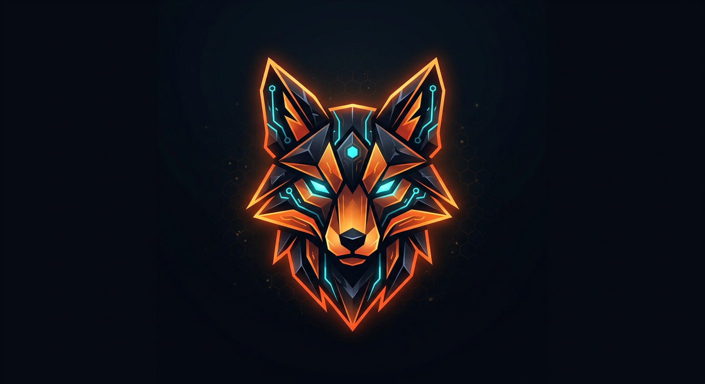

# OBX Engine

<p align="center">
  
</p>

**One engine. Any platform.** — a TypeScript-first game & application engine for
2D/3D games, desktop/mobile/web applications, websites, tools and simulations:
one codebase targeting Windows, Linux, Android, Web and headless servers.

> `ENGINE != GAME` — the engine is a **platform for creating software**.

| | |
|---|---|
| **Engine** | OBX Engine |
| **Editor** | ObsiFox Studio (in development) |
| **Packages** | `@obx/core` `@obx/runtime` `@obx/ecs` `@obx/engine` `@obx/math` `@obx/input` `@obx/rendering` `@obx/scene` `@obx/physics` `@obx/audio` `@obx/animation` `@obx/character` `@obx/ui` `@obx/save` `@obx/vehicle` `@obx/particles` `@obx/vfx` `@obx/world` `@obx/navigation` `@obx/ai` `@obx/inventory` `@obx/dialogue` `@obx/quest` `@obx/obsiscript` `@obx/scripting` `@obx/native` `@obx/editor` `@obx/project` `@obx/extensions` `@obx/networking` `@obx/server` `@obx/cli` `@obx/build` `@obx/multiplayer` `@obx/profiler` |
| **Logo / identity** | [`brand/`](brand/) — `logo.svg`, `wordmark.svg`, `brand.md` |

---

## Current status (v0.96)

| Roadmap phase | Status | Highlights |
|---|---|---|
| **v0.1 — Foundation** | ✅ | core services, game loop, fixed timestep, time/config/logging |
| **v0.2 — ECS** | ✅ | archetype ECS, queries, systems, resources, hierarchy, save/load |
| **v0.3 — 2D** | ✅ | math/transforms, renderer + backends, sprites, cameras, animation, input |
| **v0.4 — 3D** | ✅ | meshes, materials, cameras, lights, software3D rasterizer |
| **v0.5 — Gameplay** | ✅ | physics, audio, 3D animation, character, UI, save |
| **v0.6 — Motion & Effects** | ✅ | vehicles, particles, VFX |
| **v0.7 — World & AI** | ✅ | terrain, streaming/LOD, day/night, weather, A*, crowds, AI |
| **v0.8 — Gameplay Systems II** | ✅ | inventory, dialogue, quests |
| **v0.9 — Scripting** | ✅ | ObsiScript language, sandboxed JS/OS hosts, hot reload, FFI, WASM |
| **v0.10 — Editor core** | ✅ | ObsiFox Studio model: scene editing + undo/redo, inspector, project system, extensions |
| **v0.95 — Build & Advanced** | ✅ | networking + dedicated server + obsifox CLI + build/export (5 targets) |
| **v0.96 — Advanced Systems** | ✅ | multiplayer lobby/rooms/matchmaking, open world streaming + sim, AI brains, fog/foliage/decals/water, profiler |
| v1.0 | ⬜ | see [`docs/ROADMAP.md`](docs/ROADMAP.md) |

Latest update screenshot: [`docs/screenshots/v096-update.svg`](docs/screenshots/v096-update.svg)

---

## Getting started

```bash
npm install
npm test                # 493 tests (vitest)
npm run example:twod    # renders a real PNG frame with the 2D engine
npm run example:hello   # real-time 60 FPS loop demo
npm run example:ecs     # deterministic ECS tour
```

### Minimal code

```ts
import { Application, Camera2D, Colors, Renderer2D, SoftwareBackend, Texture } from "@obx/engine";

const backend = new SoftwareBackend(960, 540);
const renderer = new Renderer2D(backend);
const camera = new Camera2D({ viewportWidth: 960, viewportHeight: 540 });

renderer.begin(camera, Colors.obsidian);
renderer.drawSprite({
  texture: Texture.solid(Colors.foxOrange, 16, 16),
  x: 480, y: 270, width: 128, height: 128,
});
renderer.end();
```

---

## Packages

| Package | Path | Responsibility (roadmap §) |
|---|---|---|
| `@obx/core` | `core/` | errors, logging, events, signals, clock, scheduler, config, memory, lifecycle (§2) |
| `@obx/runtime` | `runtime/` | game loop, loop drivers, frame limiter, FPS, tasks, platforms (§3, §62, §64) |
| `@obx/ecs` | `ecs/` | entities, components, archetypes, queries, systems, resources, serialization (§4, §5, §36) |
| `@obx/math` | `math/` | vectors, matrices, quaternions, bounds, colors, transforms (§6) |
| `@obx/input` | `input/` | keyboard, mouse, touch, gamepad, actions, axes, profiles (§20) |
| `@obx/rendering` | `rendering/` | 2D renderer, textures, sprite sheets, animation, camera, batching, backends, PNG (§7, §9) |
| `@obx/scene` | `scene/` | transform components, hierarchy propagation, interpolation (§5, §6) |
| `@obx/engine` | `engine/` | `Engine` + `Application` facades re-exporting the full stack (§2, §51) |

### Repository layout (target)

```
obx-engine/
├── core/        runtime/     ecs/        engine/      math/        input/
├── rendering/   scene/       physics/    audio/       animation/   networking/
├── scripting/   ui/          assets/     world/       ai/          tools/
├── editor/      cli/         build/      plugins/     native/      wasm/
├── runtimes/    templates/   examples/   tests/       docs/        brand/
└── packages/
```

---

## Design highlights

- **Fixed-timestep game loop** with interpolation alpha, time scale, pause and
  spiral-of-death protection — driver-agnostic (manual/timeout/...).
- **Archetype ECS**: dense SoA columns, generation-safe entity handles,
  cached `all/any/none` queries, topological system scheduling.
- **2D renderer with real output**: CPU camera math, layer-sorted sprite
  batching, a pixel-tested software rasterizer, a Canvas2D backend and PNG
  export (portable, dependency-free).
- **Input abstraction**: actions/axes mapping across keyboard, mouse, touch and
  gamepads with a DOM adapter and full manual injection for tests/servers.
- **Scene transforms**: parent/child propagation with previous/current state for
  render interpolation, custom serialization hooks.
- **Everything tested** — 153 unit + integration tests, pixel-exact renderer checks.

---

## License

MIT
