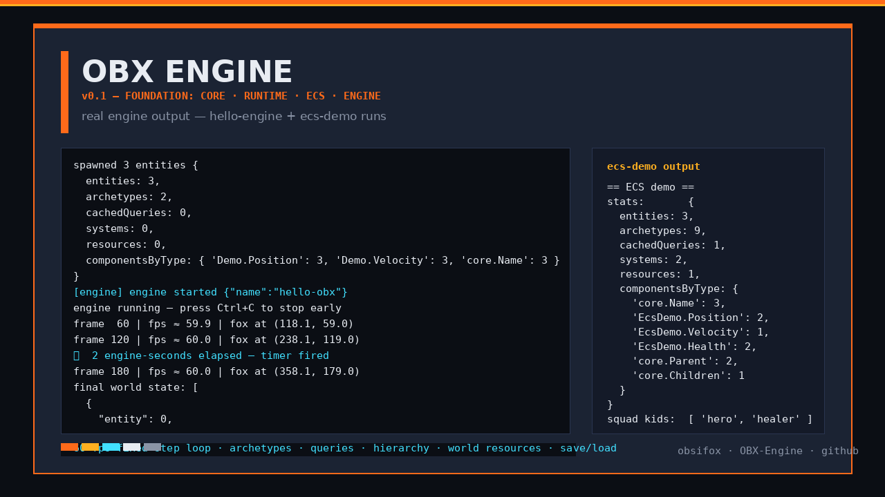

# v0.1 — Foundation

**Tag:** `v0.1.0` · **Date:** 2026-09-28 · **Scope:** core · runtime

The first brick: deterministic timing, structured logging, events, configuration and
platform-agnostic runtime services that every later package builds on.

## What's inside

- **@obx/core** — `Logger` with levels and pluggable sinks (`MemoryLogSink`,
  `ConsoleLogSink`), `EventBus` + `Signal`, `Clock` (scale, pause, ms helpers),
  `Scheduler` (deferred/repeating tasks), `Lifecycle` state machine, `ConfigStore`
  (deep-merged frozen config), `MemoryTracker` snapshots, typed `EngineError` family
  (`InvalidState`, `InvalidArgument`, `NotFound`, `Config`, …) with `assert`/`ensure`.
- **@obx/runtime** — `GameLoop` (fixed timestep, interpolation factor, driver-based),
  loop drivers (`ManualLoopDriver`, `TimeoutLoopDriver`), `FpsCounter`, `FrameLimiter`,
  platform abstraction (`ManualPlatform`, `NodePlatform`, `BrowserPlatform`,
  `detectPlatform`), `TaskSystem` for async jobs.

## Tests

47 green (core 29, runtime 18) — including real fixed-step loop runs asserting
deterministic frame budgets and clock scaling/pause behavior.

## Output

Real engine run — `hello-engine` boots the loop, spawns state, ticks at a fixed 60 fps,
fires scheduled timers and dumps final world state:



Reproduce:

```bash
npm install && npx tsc -b core runtime
node examples/hello-engine/index.js
```

## Highlights

- Determinism was a day-one requirement: fixed timestep, clamped catch-up, no globals.
- Every core capability is a small, fully tested class — no framework magic.
