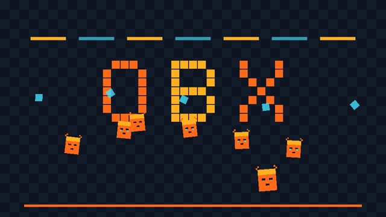

# v0.3 — 2D Release + OBX Engine Identity

**Tag:** `v0.3.0` · **Date:** 2026-09-28 · **Scope:** math · rendering · input · scene · brand

The project gets its name, its face, and a complete 2D stack.

## What's inside

- **Identity** — the project migrates to **OBX Engine** (npm scope `@obx`); the editor
  concept is **ObsiFox Studio**. Authentic brand kit in `brand/`: fox-orange `#FF6A1A`,
  ember `#FFB020`, signal-cyan `#41E0FF`, on an obsidian `#0B0E14` base — logo, wordmark,
  hero fox, `brand.md` usage rules.
- **@obx/math** — `Vec2/Vec3`, `Quat`, `Mat4`, `AABB`/`Sphere` bounds, `Color` (hex parse,
  CSS strings, `multiplyScalar`), `Transform2D`, `Transform3D`.
- **@obx/rendering (2D)** — `SoftwareBackend` (exact rasterization, z-tests),
  `SpriteBatcher`, `Texture`, `SpriteSheet` (row/column/flip, packed JSON),
  `Camera2D` (zoom, rotation, shake with trauma decay, screen↔world), `Renderer2D`,
  `encodePng`.
- **@obx/input** — action maps with key/mouse/wheel, pressed/held/released edges,
  `InputBindings` (deterministic JSON serialization), axis bindings.
- **@obx/scene** — `Scene`, `SceneNode` (world transforms), `SceneManager` (switch/fade).

## Tests

69 new tests green (math 30, rendering 21, input 11, scene 7).

## Output

`examples/twod-demo` — the v0.2 raster frame re-rendered through the full 2D pipeline
(batcher + camera + input bindings):



Reproduce:

```bash
npm install && npx tsc -b math rendering input scene
node examples/twod-demo/index.js
```

## Highlights

- `write-webp` experiments landed PNG instead — `encodePng` with RGBA-8 and CRC32.
- Camera shake test asserts exact 525-frame trauma decay — pixel-determinism held.
