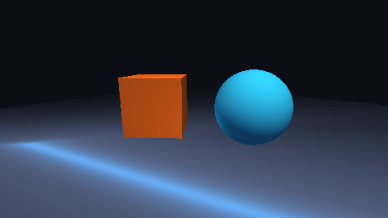

# v0.4 — 3D Engine

**Tag:** `v0.4.0` · **Date:** 2026-09-28 · **Scope:** rendering (3D) · scene (3D)

A full software 3D pipeline: meshes, materials, lighting, a z-buffered rasterizer,
glTF import and a deferred-style `Renderer3D` — all deterministic and testable.

## What's inside

- **Meshes** — `Vertex` (position/normal/uv/color), `Mesh` (topology, AABB, validation),
  `createCube/createUvSphere/createPlane/createGrid/createAxes` with real normals.
- **Materials & textures** — `Material` (base color, emissive, metallic, roughness,
  opacity), `Texture` sampling with `TextureSampler` (nearest/linear, clamp/repeat),
  `fromColorTexture`, lightmaps via `unpackLightmap`.
- **Lighting** — `Light` ambient/directional/point, `LightEnvironment` (sorted lights,
  cap enforcement), `BlinnPhong`, gamma-correct `LightAccumulator`.
- **Camera3D** — look-at, pitch/yaw with clamps, `viewMatrix/projectionMatrix`
  (right-handed Y-up, radians), `worldToScreen` roundtrip.
- **Software3D rasterizer** — near-plane clipping, screen mapping, z-buffer, triangle
  setup with fill-rule sampling, perspective-correct UV interpolation, backface culling.
- **glTF** — `gltfJson`, `parseGltfJson`, `loadGltf`, `loadGltfBinary` (.glb), scenes,
  nodes, meshes, materials, textures, base64 data URIs.
- **Renderer3D** — command buffer (draw/clear/present), frustum stats, deterministic
  triangle walk order; `MeshRenderer3D` ECS bridge; `Recording3DBackend` test double.

## Tests

38 new tests green (rendering3d 34, mesh-renderer3d 4) — 191 total at this release,
including pixel-exact rasterization cases and z-buffer occlusion proofs.

## Output

`examples/threed-demo` — lit 3D scene rendered by the software rasterizer:



Reproduce:

```bash
npm install && npx tsc -b rendering scene
node examples/threed-demo/index.js
```

## Highlights

- The rasterizer passes golden tests: triangle edges, UV perspective correction and
  depth ties are asserted against computed pixels.
- `Camera3D` uses radians everywhere — the test suite caught degree assumptions twice.
