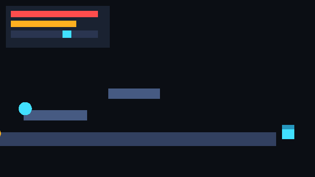

# v0.5 — Systems Layer

**Tag:** `v0.5.0` · **Date:** 2026-09-28 · **Scope:** physics · character · animation · audio · ui · save

Six game systems, six packages, one combined demo — the engine can now run a character
through a world, animate it, play sound, draw a HUD and save the session.

## What's inside

- **@obx/physics (21 tests)** — shapes (sphere/box/plane), bodies (dynamic/kinematic/
  static, restitution, friction, damping, layers, triggers), sequential-impulse world
  solver, collision + trigger events, raycast/sphere-cast, distance & spring joints,
  `CharacterController` (move/jump/run/crouch/fly, grounded snapping).
- **@obx/character (5 tests)** — `Health`, `Stamina` (drain/regen/exhaustion),
  `Equipment` slot modifiers, `InteractionSystem`, `Character` facade over the
  physics controller.
- **@obx/animation (12 tests)** — tracks (step/linear), clips + sampling,
  `AnimationPlayer`, `AnimationStateMachine` with crossfade, `BlendTree1D`, skeleton
  world poses, weighted masked layers, root motion, two-bone IK, quaternion slerp.
- **@obx/audio (14 tests)** — clips + tone/noise generators, `Envelope` curves,
  voices, `AudioMixer` buses (pitch, loop, equal-power pan, 3D attenuation, listener),
  gain/echo/reverb effects.
- **@obx/ui (11 tests)** — node tree, measure + flex layout (justify/align/gap/padding,
  absolute anchors/pivots), paint to draw commands, hit testing, text input, sliders,
  scrolling lists, windows, tween manager, brand theme.
- **@obx/save (10 tests)** — provider registry with versioned migration, RLE `packBits`,
  `fnv1a` checksums, base64, `xorCrypt` encryption, storage abstraction, `Autosave`,
  cloud client, corruption detection.

## Tests

73 new tests green — 264 total. The suite also exposed real bugs before they shipped:
an echo delay line reading the wrong head, a loop wrap eating a frame, UI root layout
ignoring its own style, and save metadata dropping provider ids on reload.

## Output

`examples/v05-demo` — one deterministic run combining all six systems: physics scene
with bouncing spheres and crates, a character that walks/runs/jumps, animation bob,
audio rendered through an echo bus, HUD (panel + bars + slider) painted from the ui
package, and a save roundtrip with checksum `4c79f13c`:



Reproduce:

```bash
npm install && npx tsc -b physics character animation audio ui save
node examples/v05-demo/index.js
```

## Highlights

- 264/264 tests green across 17 packages; `npx vitest run` is fully deterministic.
- Every system is independently usable — no package reaches into another's internals.
