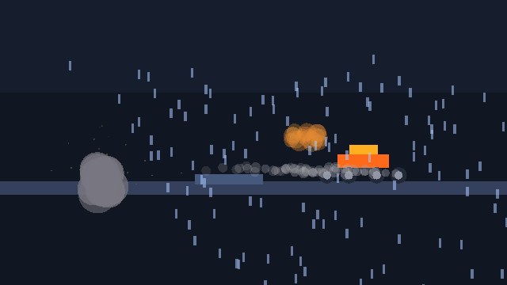

# v0.6 — Motion & Effects

**Tag:** `v0.6.0` · **Date:** 2026-09-28 · **Scope:** vehicle · particles · vfx

Vehicles with real suspension, a particle engine and a VFX layer — plus per-version
GitHub releases with notes and rendered outputs for v0.1 through v0.6.

## What's inside

- **@obx/vehicle (9 tests)** — wheel raycasts + spring/damper suspension, steering,
  braking, engine torque curve, gearbox with up/downshift + reverse, impact damage,
  `createCar`, `VehicleAI` (pure-pursuit waypoints + yaw damping).
- **@obx/particles (11 tests)** — curves, emitters (cone, gravity, drag, size/color over
  life), world collision (bounce/kill), trails, `GpuParticleBuffer` SoA batches,
  presets (smoke/fire/sparks/dust/rain/snow with volume spawns).
- **@obx/vfx (9 tests)** — `VfxGraph` timed sequences, `ScreenEffects`
  (fade/flash/shake/vignette), `WeatherSystem` (rain/snow + wind), explosion/impact
  compositions.
- **@obx/core +4** — seeded `Random` (mulberry32).

## Tests

35 new green — **299 total** across 20 packages. The work uncovered and fixed two real
engine bugs: `overlapBoxPlane` (inverted — fake contacts, bodies exploding to 1e30) and
the suspension damper sign; both now have regression coverage.

## Output

`examples/v06-demo` — car with suspension driving through rain, tire smoke, crate smash
with sparks and a timed explosion graph (screen shake + flash) mid-flight:



Reproduce:

```bash
npm install && npx tsc -b vehicle particles vfx
node examples/v06-demo/index.js
```

## Highlights

- The suspension rests at analytically predicted ride height (0.977 m, 0.113 compression).
- Every particle sim is seed-reproducible — the same run renders the same frame twice.
