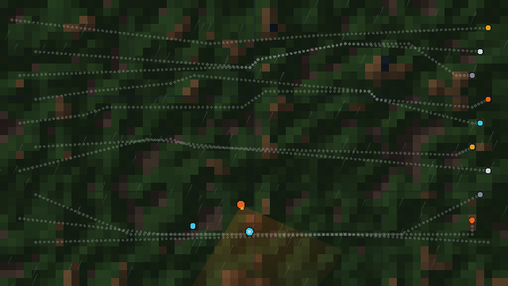

# v0.7 — World, Navigation & AI

**Tag:** `v0.7.0` · **Date:** 2026-09-28 · **Scope:** world · navigation · ai

Procedural terrain, chunked streaming with LOD, day/night and weather — plus A*
pathfinding with dynamic obstacles and crowd avoidance, and an AI stack with
perception, state machines, behavior trees, utility AI, goals and schedules.

## What's inside

- **@obx/world (15 tests)** — `Heightfield` (seeded fBm value noise: generate,
  bilinear `sample`, `normal`), `WorldPartition` (view/unload radii with hysteresis,
  `budgetPerTick` streaming, per-chunk LOD), `LodSystem.pick`, `Region`/`RegionSystem`
  (bounds + tags), `DayNightCycle` (normalized day time, sun elevation/color, ambient),
  `WeatherScheduler` (seeded markov clear/cloudy/rain/storm with intensity easing),
  `SimulationTiers` (distance-tiered intervals with catch-up dt and culling radius),
  `WorldPersistence` (cell store, serialize/restore), `chunkKey`.
- **@obx/navigation (15 tests)** — `NavGrid` (walkability, costs, rect blocks, world↔cell),
  `AStar` (8-way, corner-cut prevention, cost-aware, deterministic), `lineOfSight`,
  `smoothPath` (string-pulling with LOS), `PathAgent` (following + arrival + avoidance),
  `Crowd` (shared-neighbor separation), `DynamicObstacle`, `NavigationRegion`.
- **@obx/ai (16 tests)** — `Blackboard`, `StateMachine` (enter/update/exit hooks),
  behavior trees (`Sequence`, `Selector`, `Inverter`, `Repeater`, `Condition`, `Action`,
  `BehaviorTree`), `UtilityAI`, `Perception` (vision cone + range + occlusion callback,
  hearing), `Schedule` (time-of-day entries incl. midnight wrap), `GoalSystem`
  (priority + done switching), `NpcAgent`, brains (`FsmBrain`, `TreeBrain`) and presets
  (`patrolBrain` chases on sight or sound, `animalBrain` flees on hearing).

## Tests

46 new green — **345 total** across 24 files. All packages bumped to 0.7.0 in lockstep.

## Output

`examples/v07-demo` — top-down world: 64×36 procedural terrain shaded by the live sun,
10 agents crossing on smoothed A* paths with crowd avoidance around water, cliffs and a
dynamic landslide, a player marker and a patrolling NPC that hears/sights the player and
chases — captured mid-chase at golden hour with seeded rain:



Demo stats: `steps 120 · agents 10/10 reached · npcMode chase · playerDistanceToNpc 3.56 ·
weather rain (0.52) · sunElevation 0.125 · dayTime 0.73 · loadedChunks 96`.

Reproduce:

```bash
npm install && npx tsc -b world navigation ai
node examples/v07-demo/index.js
```
