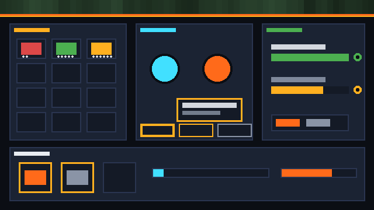

# v0.8 — Inventory, Dialogue & Quests

**Tag:** `v0.8.0` · **Date:** 2026-09-28 · **Scope:** inventory · dialogue · quest

The gameplay layer: items with stacks, weight, durability and equipment; branching
dialogue with conditions, variables, localization and voice hooks; quests with
objectives, dependencies, rewards, branching and full state serialization.

## What's inside

- **@obx/inventory (10 tests)** — `ItemRegistry` (definitions, metadata merge),
  `Item` (stacks, `split`, weight, `damage`/`repair`/`destroyed`, `sameKind`),
  `Inventory` (stacking adds with leftovers, slot/weight limits, `find`/`findAll`/
  `count`/`removeById`, `swap`, `transferTo`, `onAdd`/`onRemove` veto hooks),
  `Container` (open/close with its own inventory), `Equipment` (typed slots,
  equip-swaps, weight/tags/durability aggregates).
- **@obx/dialogue (5 tests)** — `DialogueGraph` (nodes + `validate` reference checks),
  `DialogueRunner` (start/advance/choose, condition-filtered choices, effects,
  history, `onSpeak`), `DialogueVariables`, `LocalizedText` (locale tables with
  fallback), voice hook ids per node, injectable `TextResolver`.
- **@obx/quest (8 tests)** — `QuestSystem` (define/start with prerequisites,
  `notify` event progress, optional objectives, `isComplete`/`objectiveDone`,
  `fail`/`abandon`, `claimRewards` once with flags, `followUps` branching,
  `available`/`activeQuests`/`completedQuests`, versioned `serialize`/`restore`).

## Tests

23 new green — **368 total** across 27 files. All packages bumped to 0.8.0 in lockstep.

## Output

`examples/v08-demo` — a merchant encounter driven by the real systems: dialogue with a
condition-locked choice (accept/price visible, VIP locked), the accept branch starts the
herb quest, five collect events complete it, rewards (10 coins) land in the inventory,
the follow-up "cure" quest unlocks with 2/3 hunt progress, and sword + helmet move into
equipment slots — visualized as the game HUD (inventory grid, dialogue scene with choice
pills, quest tracker, equipment strip, weight and objective bars):



Demo stats: `dialogue greet→bye (2 visible choices, fa localization) · herbs completed
5/5 · cure active 2/3 · inventory 5 herbs + 10 coins + 2 potions (1.9 kg) · equipped
sword + helmet (durability 160)`.

Reproduce:

```bash
npm install && npx tsc -b inventory dialogue quest
node examples/v08-demo/index.js
```
